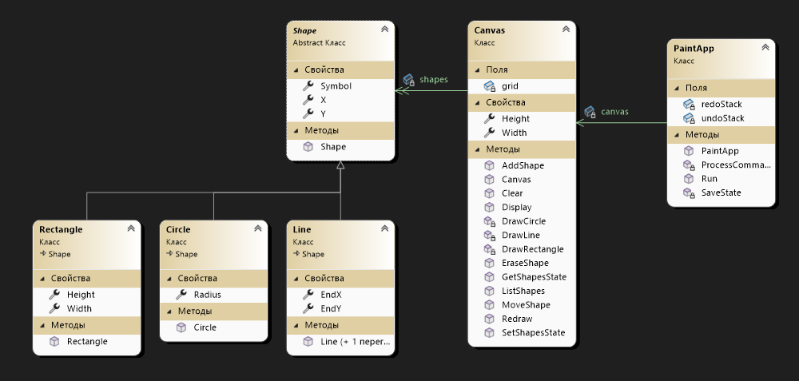

# ООП Лаб 1 Console Paint

## Войно Никита 353504

### UML диаграмма классов:

## Функциональные требования

#### 1. Создание холста
Создается холст разимерами 20x10 символами, заполненные фоновым символом `(·)`.

#### 2. Рисование фигур
Поддерживаемые фигруы:
    1. Круг: задается координатами центра (X,Y), радиусом и смоволом отрисовки.
    2. Прямоугольник: задается кооординатами верхнего левого угла (X,Y), шириной, высотой и символом отрисовки.
    3. Линиия: задается координатами начала (X,Y), координатами конца (EndX,EndY) и символом для отрисовки.

#### 3. Удаление фигур
Полльзователь иожет удалить фигуру по её индексу в списке фигур, после чего золст перерисовывается. 

#### 4. Перемещение фигур 
Пользователь может перерместить фигуру, указам её индекс и новые координаты (X,Y).
Для линий конечные координаты обновляются с сохранением их относительного положения.

#### 5. Сохрание и загрузка файла
Пользователь может сохранить текущее состояние фигур в JSON-файл.
Пользователь может загрузить состояние фигур из JSON-файла.

#### 6. Отмена и повтор действий(Undo/Redo)
Поддерживается отмена последних действий(ддобавление, удаление, перемещение фигур).
Поддерживается повтор отмененных действий.

#### 7. Очистка холста
Пользователь может удалить все фигуры и восстановить холст в исзодное состояние с фоновым символом `(·)`.

#### 8. Просмотр списка фигур
Пользователь может вывести список всех фигур на холсте с их парамметрами(тип, координаты, размеры, символ).

## Подробное описание функций с использование Use-Case

### Use-Case 1: Создание холста
Система задет новый холст размером 20 на 10 символов при запуске программы.
Актер: Система.
Предусловие: Приложение "Paint App" запущенно.
Основной сценарий:
    1. Система инициализирует объект `Canvas` с параметрами 20x10.
    2. Система создаёт двумерный массив grid размером [высота, ширина]
    3. Система вызывает метод Clear(), заполняя массив символом `(·)`
Постусловие:Холст создан, заполнен фоновым символом и готов к использованию.

### Use-Case 2: Добавление фигуры
Пользователь добавляет новую фигуру на холст.
Актер: Пользователь.
Предусловия: Холст создан, пользователь выбрал команду "1".
Основной сценарий:
    1. Пользователь вводит тип фигуры (R — прямоугольник, C — круг, L — линия).  
    2. Пользователь вводит координаты X и Y начальной точки.
    3. Пользователь вводит символ для отрисовки фигуры.  
    4. В зависимости от типа фигуры: 
        4.1. Для круга: пользователь вводит радиус.  
        4.2. Для прямоугольника: пользователь вводит ширину и высоту. 
        4.3. Для линии: пользователь вводит координаты конечной точки (EndX, EndY).
    5. Система создаёт объект выбранной фигуры с указанными параметрами.  
    6. Система добавляет фигуру в список `shapes`.  
    7. Система вызывает метод Redraw() для обновления холста.
Исключения:
    Если введён неверный тип фигуры, система выводит сообщение об ошибке и завершает действие.
Постусловия: Новая фигура добавлена на холст и отображена.

### Use-Case 3: Удаление фигуры
Пользователь удаляет фигуру с холста по её индексу.
Актер: Пользователь.
Предусловие: На холсте есть хотя бы одна фигура, пользователь выбрал команду "2".
Основной сценарий:
    1. Пользователь вводит индекс фигуры для удаления.  
    2. Система проверяет валидность индекса.  
    3. Система удаляет фигуру из списка `shapes`.  
    4. Система вызывает метод Redraw() для обновления холста.
Исключения:
    Если индекс неверен, система игнорирует команду.    
Постусловия: Новая фигура добавлена на холст и отображена.

### Use-Case 4: Перемещение фигуры
Пользователь перемещает фигуру на новые координаты.
Актер: Пользователь.
Предусловие: На холсте есть хотя бы одна фигура, пользователь выбрал команду "3".
Основной сценарий:
    1. Пользователь вводит индекс фигуры.  
    2. Пользователь вводит новые координаты X и Y.  
    3. Система проверяет валидность индекса.  
    4. Система обновляет координаты начальной точки фигуры.  
    5. Для линии система также обновляет конечные координаты относительно смещения.  
    6. Система вызывает метод Redraw() для обновления холста.
Исключения:
    Если индекс неверен, система игнорирует команду.
Постусловия: Фигура перемещена на новые координаты, холст обновлён.

### Use-Case 5: Сохранение состояния
Пользователь сохраняет текущее состояние фигур в файл.
Актер: Пользователь.
Предусловие: Пользователь выбрал команду "4".
Основной сценарий:
    1. Пользователь вводит имя файла.  

    2. Система сериализует список shapes в формат JSON.  

    3. Система записывает JSON-строку в файл с указанным именем.
Постусловия: Текущее состояние фигур сохранено в файл.

### Use-Case 6: Загрузка состояния
Пользователь загружает состояние фигур из файла.
Актер: Пользователь.
Предусловие: Пользователь выбрал команду "5".
Основной сценарий:
    1. Пользователь вводит имя файла.  
    2. Система проверяет существование файла.  
    3. Система считывает содержимое файла.  
    4. Система десериализует JSON-строку в список shapes.  
    5.Система вызывает метод Redraw() для обновления холста.
Исключения:
    Если файл не найден, система выводит сообщение об ошибке и завершает действие.
Постусловия: Состояние фигур загружено из файла, холст обновлён.

### Use-Case 7: Отмена действия (Undo)
Пользователь отменяет последнее действие.
Актер: Пользователь.
Предусловие: Пользователь выбрал команду "6", в стеке `undoStack` есть хотя бы одно состояние.
Основной сценарий:
    1. Система сохраняет текущее состояние в стек redoStack.  
    2. Система извлекает последнее состояние из undoStack.  
    3. Система восстанавливает список shapes из извлечённого состояния.  
    4. Система вызывает метод SetShapesState для обновления холста.
Постусловия: Предыдущее состояние восстановлено, холст обновлён.

### Use-Case 8: Повтор действия (Redo)
Пользователь повторяет отменённое действие.
Актер: Пользователь.
Предусловие: Пользователь выбрал команду "7", в стеке redoStack есть хотя бы одно состояние.
Основной сценарий:
    1. Система извлекает последнее состояние из redoStack.  
    2. Система добавляет это состояние в undoStack.  
    3. Система обновляет список shapes и вызывает SetShapesState для обновления холста.
Постусловия: Следующее состояние восстановлено, холст обновлён.

### Use-Case 9: Повтор действия (Redo)
Пользователь удаляет все фигуры с холста.
Актер: Пользователь.
Предусловие: Пользователь выбрал команду "8".
Основной сценарий:
    1. Система очищает список shapes.  
    2. Система вызывает метод Clear() для заполнения холста символом ·.
Постусловия: Холст очищен, все фигуры удалены.

### Use-Case 10: Просмотр списка фигур
Пользователь просматривает список всех фигур на холсте.
Актер: Пользователь.
Предусловие: Пользователь выбрал команду "9".
Основной сценарий:
    1. Система проверяет наличие фигур в списке `shapes`.  
    2. Если фигуры есть, система выводит их список с параметрами (тип, координаты, размеры).  
    3. Если фигур нет, система выводит сообщение "На холсте нет фигур".
Постусловия: Информация о фигурах выведена в консоль.

### Use-Case 11: Выход из приложения
Пользователь завершает работу приложения.
Актер: Пользователь.
Предусловие: Пользователь выбрал команду "10".
Основной сценарий:
    1. Система завершает выполнение приложения.
Постусловия: Приложение закрыто.

